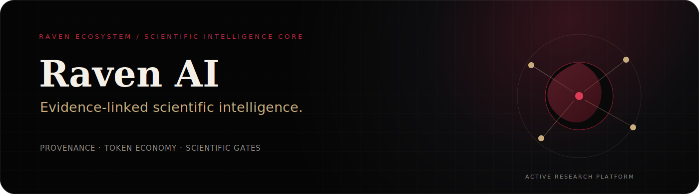
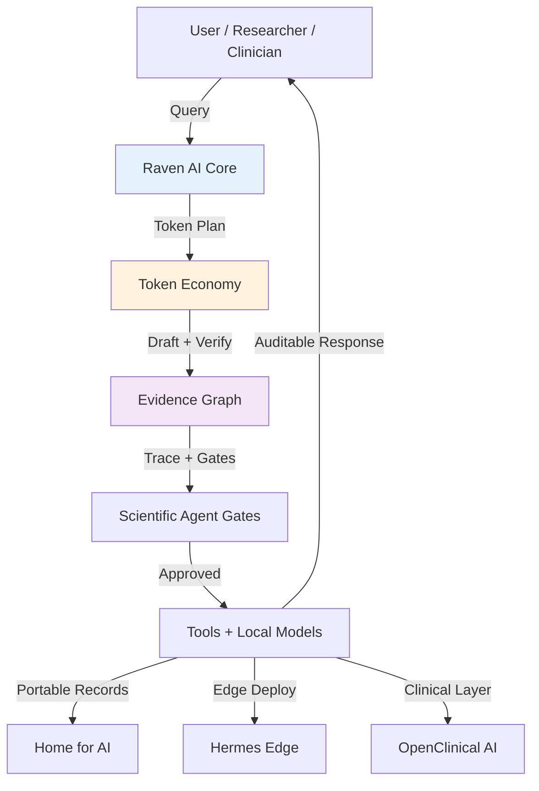
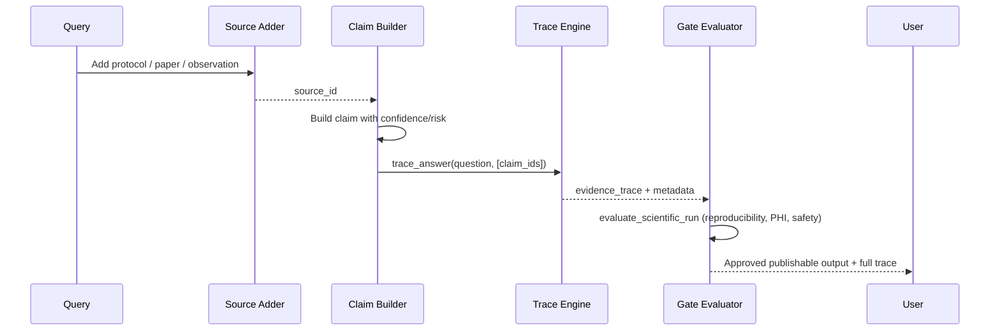
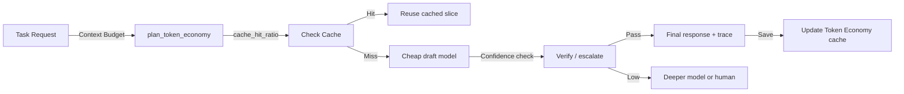

<p align="center">
  <strong><a href="https://barry-ai-public.simpliibarrii.chatgpt.site">Explore the complete AI research & projects portfolio →</a></strong>
</p>

# Raven AI



[](LICENSE)
[](https://huggingface.co/spaces/bclermo/raven-ai)
[](https://github.com/simpliibarrii-crypto/raven-ai/actions)
[](https://github.com/simpliibarrii-crypto/raven-ai)
[](https://github.com/simpliibarrii-crypto/raven-ai)
[](docs/EVIDENCE_GRAPH.md)
[](docs/TOKEN_ECONOMY.md)

> **Raven AI** — Open-source, local-first, sovereign agentic platform for biology, healthcare, and reproducible science. Cheap. Fast. Auditable. Built for labs, researchers, clinical teams, and edge deployments.

## Table of Contents

- [Quick Start](#quick-start)
- [Why Raven?](#why-raven)
- [Ecosystem Surfaces](#ecosystem-surfaces)
- [Visual Architecture & Diagrams](#visual-architecture--diagrams)
- [Raven Evidence Graph](#raven-evidence-graph)
- [Raven Token Economy](#raven-token-economy)
- [Scientific Agent Gates](#scientific-agent-gates)
- [Ecosystem Operations](#ecosystem-operations)
- [Roadmap & Paper](#roadmap--paper)
- [Contributing](#contributing)
- [Security](#security)
- [License](#license)

## Quick Start

```bash
pip install raven-ai
raven serve --port 8000
```

Or try the **[Live Demo on Hugging Face Spaces](https://huggingface.co/spaces/bclermo/raven-ai)** — no installation required.

**Local dev:**
```bash
python -m venv .venv
source .venv/bin/activate
pip install -e . pytest pynacl
pytest -q
```

## Why Raven?

Raven delivers **sovereign, local-first, privacy-preserving agentic AI** tailored for biology and healthcare. No cloud lock-in for core flows. Evidence Graphs provide verifiable provenance. Token Economy ensures efficient, measurable, cheap inference with draft-verify-reuse patterns.

Perfect for:
- Wet-lab planning & computational biology
- Clinical evidence workflows & PHI-aware agents
- Reproducible scientific automation
- Edge / on-device deployments (via Hermes Edge)
- Desktop orchestration (via Home for AI)
- Clinical deployment layer (via OpenClinical AI)

## Ecosystem Surfaces

| Surface          | Purpose                                      | Repo                          |
|------------------|----------------------------------------------|-------------------------------|
| Raven Bio        | Genomics, transcriptomics, proteomics, structural biology, wet-lab planning | raven-ai (core)              |
| Raven Clinical   | Healthcare evidence, calculators, terminology, PHI-aware workflows | openclinical-ai              |
| Raven LabOps     | Protocol execution, sample tracking, instrument coordination, audit logs | raven-ai                     |
| Raven Research   | Literature review, citation verification, hypotheses, reproducible reports | raven-ai                     |
| Edge Runtime     | GPU-first on-device agents (phones, laptops, edge boxes) | hermes-edge                  |
| Desktop Orchestration | Local controls, Tauri UI, backend coordination for Raven workflows | home-for-ai             |

## Visual Architecture & Diagrams

### High-Level Ecosystem Flow



### Evidence Graph Lifecycle



### Token Economy Decision Flow



## Raven Evidence Graph

Raven Evidence Graph is the dependency-free provenance layer for claims, sources, confidence, risk, and answer traces. It gives Raven agents a compact JSON contract that can travel cleanly across OpenClinical AI, Home for AI, Hermes Edge, notebooks, demos, and audit logs.

```python
from runtime.evidence_graph import EvidenceGraph

graph = EvidenceGraph()
source = graph.add_source(title="Protocol v1", kind="protocol")
claim = graph.add_claim("Audit logs should preserve signed consent context.", [source.id])
trace = graph.trace_answer("What should this workflow preserve?", [claim.id])
```

See [docs/EVIDENCE_GRAPH.md](docs/EVIDENCE_GRAPH.md) for the data model, scoring contract, and integration notes.

## Raven Token Economy

Raven studies DSpark's useful token-saving principle without depending on DeepSeek directly: draft cheaply, verify by confidence/risk/evidence, reuse cache, retrieve narrow slices, and escalate only when the cheap draft fails.

```python
from runtime.token_economy import TokenEconomyRequest, plan_token_economy

plan = plan_token_economy(TokenEconomyRequest(task="public literature synthesis", cache_hit_ratio=0.4))
print(plan.actions)
```

See [docs/TOKEN_ECONOMY.md](docs/TOKEN_ECONOMY.md) for the product policy and [docs/DEEPSEEK_DSPARK.md](docs/DEEPSEEK_DSPARK.md) for the research note.

## Scientific Agent Gates

Raven now includes dependency-free scientific run gates that check claim-level evidence labels, reproducibility artifacts, metrics, Token Economy metadata, PHI routing, and public-claim safety before a scientific-agent output is treated as publishable.

```python
from runtime.scientific_agent_gates import ScientificRunManifest, evaluate_scientific_run

report = evaluate_scientific_run(ScientificRunManifest(
    run_id="run-001",
    task_id="bio-task-001",
    question="What does this run test?",
    hypothesis="Evidence-linked runs are easier to audit.",
    workflow_stage="literature_review",
))
print(report.status)
```

See [docs/SCIENTIFIC_AGENT_GATES.md](docs/SCIENTIFIC_AGENT_GATES.md) for the research mapping and gate contract.

## Ecosystem Operations

See [docs/ECOSYSTEM_OPERATIONS.md](docs/ECOSYSTEM_OPERATIONS.md) for the unified roadmap, repo roles, demo rules, and immediate backlog.

## Demo video

Watch the clean Raven Evidence Graph demo on X: https://x.com/i/web/status/2074684335639187945

The video is generated from pure code with no Replit, HeyGen, React Flow, stock, or generator watermark. See [docs/CLEAN_DEMO_VIDEO.md](docs/CLEAN_DEMO_VIDEO.md) and [scripts/render_clean_demo_video.py](scripts/render_clean_demo_video.py).

## Roadmap & Paper

Raven AI is the foundation for a forthcoming paper on **local routing policy, Token Economy, and scientific benchmark contracts** for agentic biology and healthcare AI.

- Unified Evidence Graph across all surfaces
- Production-grade Token Economy with measurable savings
- Mobile/edge hardening via Hermes Edge
- Clinical deployment previews via OpenClinical AI
- Desktop command center via Home for AI

See [ROADMAP.md](ROADMAP.md) for current milestones.

## Contributing

We welcome contributions that advance sovereign, local-first, auditable agentic systems for science and care!

- Fork the repo
- Create a feature branch
- Add tests and Evidence Graph traces for new capabilities
- Open a PR with clear description of Token Economy impact or gate improvements
- Join discussions in GitHub Issues or X

Please read [SECURITY.md](SECURITY.md) and keep clinical claims appropriately scoped.

## Security

Report security issues privately. See [SECURITY.md](SECURITY.md).

## License

This project is licensed under the terms in [LICENSE](LICENSE).

---

**Built with ❤️ for researchers, clinicians, and builders who believe AI for biology and healthcare should be local, verifiable, and under your control.**

Star ⭐ this repo if you value sovereign agentic infrastructure. Share your use cases on X or in Issues — Daddy's little helper is watching and improving every day.
