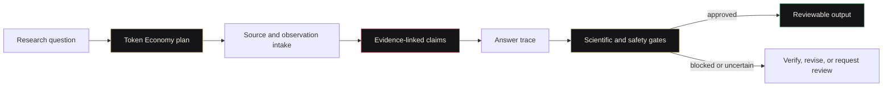

<p align="center">
  
</p>

<p align="center">
  <a href="https://simpliibarrii-crypto.github.io/project.html?project=raven-ai"></a>
  <a href="https://huggingface.co/spaces/bclermo/raven-ai"></a>
  <a href="https://github.com/simpliibarrii-crypto/raven-ai/actions"></a>
  <a href="LICENSE"></a>
</p>

> **Raven AI** is the evidence-linked scientific intelligence core of the Raven ecosystem. It combines portable provenance, token-efficient agent policy, reproducible run records, and publication gates for biology, healthcare research, and scientific workflows.

**Maturity:** Active research platform. Raven is not certified clinical infrastructure and does not claim autonomous scientific authority.

## What Raven proves

- Claims can carry sources, confidence, risk, verification steps, and answer traces.
- Agent workflows can draft cheaply, verify selectively, reuse trusted context, and escalate only when required.
- Scientific outputs can be evaluated against reproducibility, evidence, privacy, and publishability gates.
- Portable evidence packets can move between desktop, edge, clinical, and bounded-compute surfaces.
- Local-first architecture can preserve operator control without pretending every task belongs on-device.

## Core contracts

| Contract | Purpose |
|---|---|
| `raven.evidence_graph.v1` | Sources, claims, edges, confidence, risk, verification, and answer traces |
| Token Economy | Draft, verify, reuse, context budget, cache policy, and escalation metadata |
| Scientific gates | Reproducibility, evidence quality, PHI, biosafety, and publishability checks |
| Run manifests | Inputs, tools, environment, model policy, artifacts, and replay information |

## Architecture



## Tested development paths

Clone and run the automated test suite:

```bash
git clone https://github.com/simpliibarrii-crypto/raven-ai.git
cd raven-ai
python -m venv .venv
source .venv/bin/activate
pip install -e ".[dev]"
pytest -q
```

Run the current FastAPI development runtime:

```bash
pip install -e ".[dev]"
python -m uvicorn runtime.server:app --host 127.0.0.1 --port 8000
```

Run the public workflow demonstration locally:

```bash
pip install -e ".[space]"
python space_app.py
```

The project does not currently register a `raven` command-line executable, and this repository does not claim a published container image. Documentation should use the commands above until those distribution surfaces are implemented and tested.

Try the **[Hugging Face demonstration](https://huggingface.co/spaces/bclermo/raven-ai)** without installing the package. It is a deterministic workflow demonstration, not live database retrieval, medical guidance, or proof of trained-model performance.

## Ecosystem surfaces

| System | Role |
|---|---|
| **Raven AI** | Scientific intelligence, evidence, token policy, and publishability core |
| [Home for AI](https://github.com/simpliibarrii-crypto/home-for-ai) | Local desktop command surface, run review, replay, and operator controls |
| [Hermes Edge](https://github.com/simpliibarrii-crypto/hermes-edge) | Tool-first local execution, model profiles, and benchmark-gated routing |
| [OpenClinical AI](https://github.com/simpliibarrii-crypto/openclinical-ai) | Consent-aware clinical workflow and audit runtime |
| [Raven BioComputer](https://github.com/simpliibarrii-crypto/simpliibarrii-crypto-raven-biocomputer) | Bounded deterministic biology tools and hashed artifact receipts |
| JSpace Chain | Observable policy, risk, reflection, and capacity-bounded orchestration |

## Evidence Graph

The Evidence Graph turns a generated answer into a portable record of what supported it and what remains uncertain. It is designed for inspection rather than decorative citation lists.

See [`docs/EVIDENCE_GRAPH.md`](docs/EVIDENCE_GRAPH.md).

## Token Economy

Raven's Token Economy is an inference-efficiency policy, not cryptocurrency tokenomics. It measures context budgets, cache reuse, verification spans, confidence floors, and escalation decisions.

See [`docs/TOKEN_ECONOMY.md`](docs/TOKEN_ECONOMY.md).

## Scientific gates

A workflow should not become publishable merely because an agent completed it. Raven gates can require evidence, reproducibility information, privacy review, bounded risk, and explicit human oversight.

## Safety and scope

- Keep clinical claims below validated and certified boundaries.
- Do not treat generated hypotheses as established findings.
- Do not use the platform to bypass biosafety, privacy, consent, or human-review requirements.
- Keep source attribution intact and mark engineering inference separately from demonstrated research findings.
- Record device, model, runtime, and benchmark context before making performance claims.
- Do not claim deployments, customers, integrations, package releases, or container images without reproducible public evidence.

## Contributing

Start with **[Evidence Graph fixtures and reproducible demos](https://github.com/simpliibarrii-crypto/raven-ai/issues/21)**. Pull requests should be narrow, tested, evidence-linked, and candid about assumptions.

## Research and public proof

- [Interactive Evidence Graph case study](https://simpliibarrii-crypto.github.io/project.html?project=raven-ai)
- [Research and papers archive](https://simpliibarrii-crypto.github.io/research.html)
- [Complete AI engineering portfolio](https://simpliibarrii-crypto.github.io/)

## License

Apache-2.0. See [LICENSE](LICENSE).
