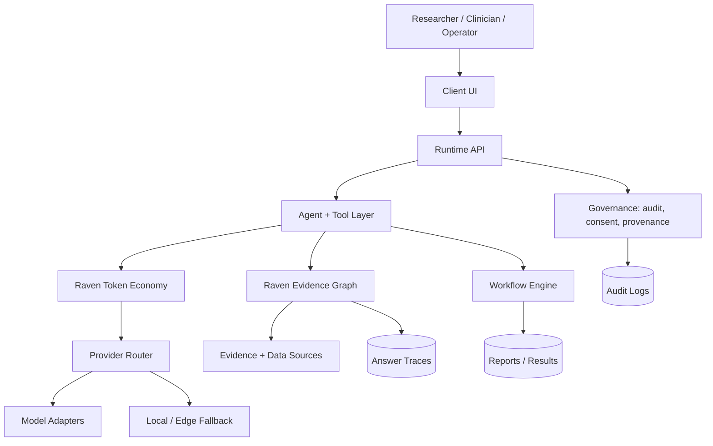

# Architecture

## Ecosystem context

This repository is part of the Raven AI ecosystem:

- **Raven AI**: flagship biology and healthcare agent platform.
- **OpenClinical AI**: healthcare deployment layer and clinical workflow substrate.
- **Home for AI**: local orchestration environment for agent workflows.
- **Hermes Edge**: edge runtime and benchmark surface for compact, local-first AI workloads.

## Architectural principles

1. Local-first where possible, cloud-optional where necessary.
2. Evidence-linked outputs for scientific and clinical work.
3. Explicit audit, provenance, and governance boundaries.
4. Modular adapters rather than hard-coded model or vendor lock-in.
5. Fail-loud behavior for privacy, safety, and policy violations.
6. Portable trace packets that can move between apps without leaking private source content by default.
7. Token economy that drafts cheaply, verifies selectively, reuses cache, narrows context, and escalates late.

## High-level diagram

## Runtime layers

- **Interface layer**: web, desktop, mobile, or CLI entry points.
- **Runtime layer**: API routes, tenancy, auth, model/tool dispatch.
- **Agent layer**: task planning, tool use, domain workflows.
- **Token economy layer**: cache reuse, context budgeting, cheap drafting, confidence-scheduled verification, thinking levels, and late escalation.
- **Provider layer**: capability profiles, privacy-aware routing, cheap-first remote inference, and local fallback.
- **Evidence layer**: claim extraction, source references, confidence scoring, risk tagging, and trace serialization.
- **Governance layer**: consent, policy checks, audit logs, provenance.
- **Deployment layer**: Docker, local runtime, cloud deployment, edge.

## Evidence Graph contract

Raven Evidence Graph is the shared runtime contract for explainable outputs. Apps can keep their own storage and UI, but they should exchange evidence in the `raven.evidence_graph.v1` shape documented in [EVIDENCE_GRAPH.md](EVIDENCE_GRAPH.md).

| App | Evidence Graph role |
|---|---|
| Raven AI | Owns the core graph objects, scoring helpers, and trace JSON format. |
| OpenClinical AI | Attaches evidence traces to clinical workflow outputs and audit records. |
| Home for AI | Stores local agent run traces and makes them inspectable from the home dashboard. |
| Hermes Edge | Emits compact evidence packets for edge benchmarks and offline runs. |

## Token economy contract

`runtime/token_economy.py` applies the DSpark-inspired product principle without binding Raven to DeepSeek directly. It tells Raven how to spend fewer tokens while preserving review quality.

| Step | Role |
|---|---|
| Cache reuse | Reuse prior summaries, traces, and known project context before adding raw context. |
| Narrow retrieval | Pull only relevant evidence slices instead of dumping full files into prompts. |
| Cheap draft | Draft with cache, tools, local-small, local-large, or cheap remote lanes first. |
| Confidence scheduling | Verify critical, high-risk, low-confidence, or weak-evidence spans first. |
| Late escalation | Escalate to stronger reasoning only after the cheap draft fails the confidence floor. |

See [TOKEN_ECONOMY.md](TOKEN_ECONOMY.md) for the product policy and [DEEPSEEK_DSPARK.md](DEEPSEEK_DSPARK.md) for the research note.

## Provider routing contract

`runtime/provider_profiles.py` defines optional model/provider capabilities before live adapters are wired. Provider profiles are secondary to Token Economy: they describe available lanes, while Token Economy decides when a lane deserves tokens.

## Current maturity

This repository may contain a mix of production-ready components and architectural previews. Components that touch clinical or biological decision-making must be treated as research/developer infrastructure until validated for the target context.
