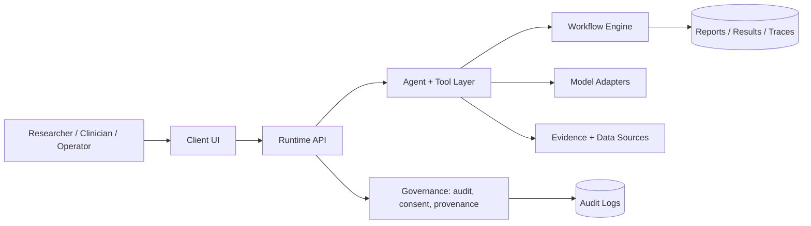

# Architecture

## Ecosystem context

This repository is part of the Raven AI ecosystem:

- **Raven AI**: flagship biology and healthcare agent platform.
- **OpenClinical AI**: healthcare deployment layer and clinical workflow substrate.
- **Home for AI**: local orchestration environment for agent workflows.

## Architectural principles

1. Local-first where possible, cloud-optional where necessary.
2. Evidence-linked outputs for scientific and clinical work.
3. Explicit audit, provenance, and governance boundaries.
4. Modular adapters rather than hard-coded model or vendor lock-in.
5. Fail-loud behavior for privacy, safety, and policy violations.

## High-level diagram

## Runtime layers

- **Interface layer**: web, desktop, mobile, or CLI entry points.
- **Runtime layer**: API routes, tenancy, auth, model/tool dispatch.
- **Agent layer**: task planning, tool use, domain workflows.
- **Governance layer**: consent, policy checks, audit logs, provenance.
- **Deployment layer**: Docker, local runtime, cloud deployment, edge.

## Current maturity

This repository may contain a mix of production-ready components and architectural previews. Components that touch clinical or biological decision-making must be treated as research/developer infrastructure until validated for the target context.
