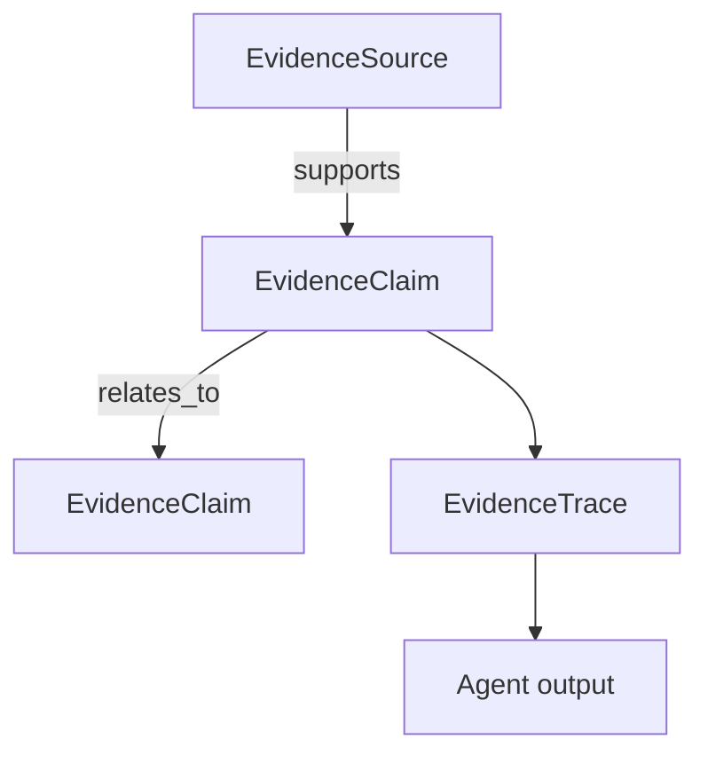

# Raven Evidence Graph

Raven Evidence Graph is the trust brain for the Raven AI ecosystem. It turns documents, agent outputs, clinical workflow notes, model-card claims, and local runtime traces into source-linked claims that can be scored, exported, audited, and explained.

The first implementation is intentionally dependency-free Python in `runtime/evidence_graph.py` so it can run in Raven AI, OpenClinical AI, Home for AI, Hermes Edge, hosted demos, and edge devices.

## What It Solves

Raven agents should not only answer. They should show why an answer deserves trust.

Raven Evidence Graph provides:

| Capability | Purpose |
| --- | --- |
| Sources | Track documents, notes, model cards, benchmark contracts, protocols, and logs |
| Claims | Convert source text or agent outputs into reviewable claim nodes |
| Entities | Extract lightweight deterministic entity candidates for navigation and filtering |
| Edges | Link sources to claims and claims to claims through typed relationships |
| Scores | Combine source quality, claim confidence, and risk tier into a conservative score |
| Traces | Attach answer-level provenance packets to agent responses |
| JSON export | Move evidence packets across apps without a database dependency |

## Core Data Model



## Quick Start

```python
from runtime.evidence_graph import EvidenceGraph

graph = EvidenceGraph()
claims = graph.ingest_document(
    title="OpenClinical shift handoff note",
    kind="clinical-note",
    uri="local://handoff/demo",
    quality=0.8,
    labels=["handoff", "clinical"],
    text="Patient consent was granted. Audit events are recorded for every inference.",
)

trace = graph.trace_answer(
    "The handoff is supported by consent and audit evidence.",
    [claim.id for claim in claims],
)

print(trace.confidence)
print(trace.risk)
print(graph.to_json())
```

## Integration Contract

All Raven ecosystem apps can exchange evidence with the same JSON schema:

```json
{
  "schema": "raven.evidence_graph.v1",
  "sources": [],
  "claims": [],
  "edges": []
}
```

### OpenClinical AI

OpenClinical AI should use Evidence Graph for:

- PSW shift-handoff claims
- consent-token context
- tenant-scoped audit explanations
- clinical safety disclaimers
- source-linked care-plan summaries

Recommended flow:

1. Create an `EvidenceSource` for each handoff note, care-plan source, FHIR bundle, or audit query.
2. Create `EvidenceClaim` entries for generated summary statements.
3. Attach an `EvidenceTrace` to `/v1/inference` responses when evidence is available.
4. Never use graph score as clinical validation or autonomous approval.

### Home for AI

Home for AI should use Evidence Graph for:

- local agent run provenance
- workspace document memory
- connector output trust trails
- user-facing "why this answer" panels
- exportable run reports

Recommended flow:

1. Store graph JSON beside local agent run artifacts.
2. Show trace confidence, risk, and linked sources in the desktop UI.
3. Route high-risk traces to review instead of auto-action.

### Hermes Edge

Hermes Edge should use Evidence Graph for:

- on-device answer traces
- benchmark claim provenance
- model-routing explanations
- offline source packets
- cloud-fallback justification when enabled

Recommended flow:

1. Keep a compact graph for local sources and benchmark contracts.
2. Attach trace packets to local model responses.
3. Prefer deterministic tools before model claims when the graph shows weak evidence.

## Risk Model

Evidence Graph uses four risk tiers:

| Tier | Use |
| --- | --- |
| `low` | General product, docs, workflow, and engineering claims |
| `medium` | Scientific, healthcare, or model-behavior claims |
| `high` | Patient, consent, diagnosis, treatment, PHI, or clinical workflow claims |
| `critical` | Reserved for future policy gates where action must stop until reviewed |

The score is not a truth oracle. It is a conservative triage signal for review, routing, and transparency.

## First Milestones

- Add the dependency-free core graph and tests.
- Attach graph traces to Raven research and clinical demo responses.
- Add OpenClinical AI response integration for consent and audit context.
- Add Home for AI UI panels for trace confidence and source links.
- Add Hermes Edge compact trace packets for local/offline model responses.
